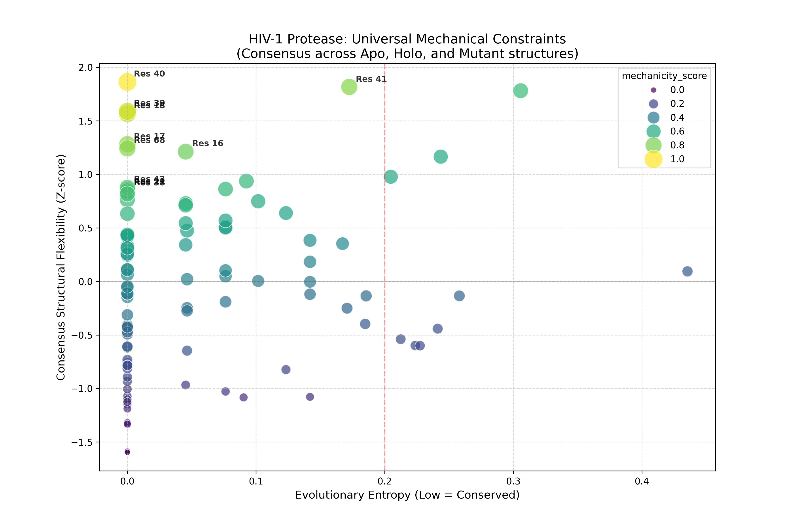

# HIV Protease Mechanicity Analysis

## Overview

This project identifies **mechanically constrained residues in HIV-1 protease**
by integrating structural dynamics and evolutionary conservation.

The goal is to discover mutation-resistant antiviral targets.

## Scientific Hypothesis

Residues that show:

• high structural flexibility  
• low evolutionary entropy  

represent mechanical control points required for protease function.

These residues may serve as **mutation-resistant antiviral targets**.

## Data Sources

Structural data: Protein Data Bank  
Sequence data: NCBI Protein database

## Pipeline

The computational workflow consists of five stages:

1. Fetch PDB structures
2. Fetch protease sequences
3. Structural flexibility analysis
4. Evolutionary entropy analysis
5. Mechanicity mapping

## Repository Structure

scripts/ – analysis scripts  
data/ – raw datasets  
results/ – computed outputs  
figures/ – visualization outputs

## Running the Analysis

Install dependencies:

pip install -r requirements.txt

Run pipeline:

python run_pipeline.py

Sequence Data ──► Entropy Analysis
                       │
                       ▼
Structure Data ──► Flexibility Analysis
                       │
                       ▼
                Mechanicity Score
                       │
                       ▼
          Candidate Mechanical Residues

## Output

The pipeline produces:

• evolutionary entropy per residue  
• structural flexibility metrics  
• integrated mechanicity scores  
• visualization of mechanical constraints

### Mechanicity Chart

### Protease Structure

# 🧬 HIV-1 Protease Mechanicity & Conservation Report

This report identifies 'Mechanical Gears': residues that exhibit high structural flexibility across Apo (1HHP), Holo (1IDB), and Mutant (1KJF) states, yet remain evolutionarily static. These represent prime targets for durable 'Block-and-Lock' interventions.

## ⚙️ Top Mechanical Constraints
|   res_no | res_name   |   consensus_flexibility |   normalized_entropy |   gap_fraction |   mechanicity_score |
|---------:|:-----------|------------------------:|---------------------:|---------------:|--------------------:|
|       40 | ASN        |                1.8628   |            0         |       0        |            1        |
|       39 | UNK        |                1.58846  |            0         |       0        |            0.920692 |
|       18 | UNK        |                1.56708  |            0         |       0.030303 |            0.914512 |
|       17 | UNK        |                1.28153  |            0         |       0        |            0.831962 |
|       68 | UNK        |                1.24281  |            0         |       0        |            0.820767 |
|       41 | UNK        |                1.81683  |            0.172497  |       0        |            0.816507 |
|       16 | UNK        |                1.21218  |            0.0453291 |       0        |            0.775108 |
|       43 | UNK        |                0.878057 |            0         |       0.030303 |            0.715321 |
|       21 | UNK        |                0.857412 |            0         |       0        |            0.709353 |
|       38 | UNK        |                0.845433 |            0         |       0        |            0.70589  |
|       44 | UNK        |                0.817859 |            0         |       0        |            0.697919 |
|       42 | UNK        |                0.760965 |            0         |       0        |            0.681471 |
|       37 | UNK        |                1.78118  |            0.305729  |       0.030303 |            0.677889 |
|       45 | UNK        |                0.937063 |            0.0925027 |       0.030303 |            0.664632 |
|       14 | UNK        |                0.86254  |            0.0763192 |       0        |            0.656585 |

## 🔍 Strategic Interpretation
- **Low Entropy + High Flex:** These are likely hinges or 'elbows' of the protein.
- **High Gap Fraction:** Use caution; low entropy may be due to poor sequence coverage.
- **Targeting Recommendation:** Focus on residues with `mechanicity_score > 0.8` for dCas9-KRAB guidance.

## Author

Leon Owade  
MSc Chemistry  
Research interest: computational structural biology